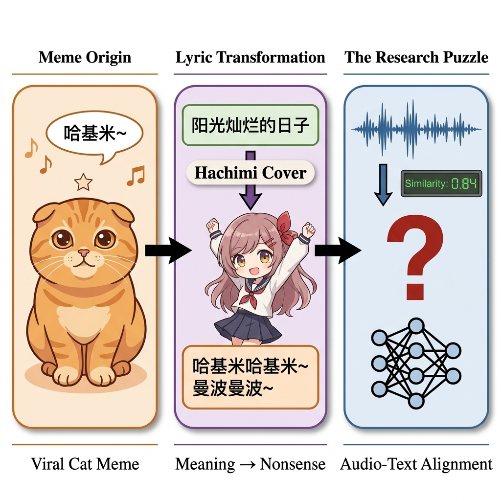
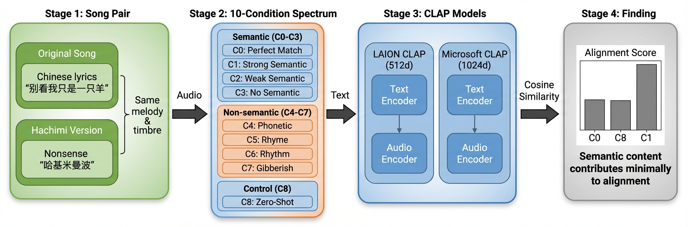
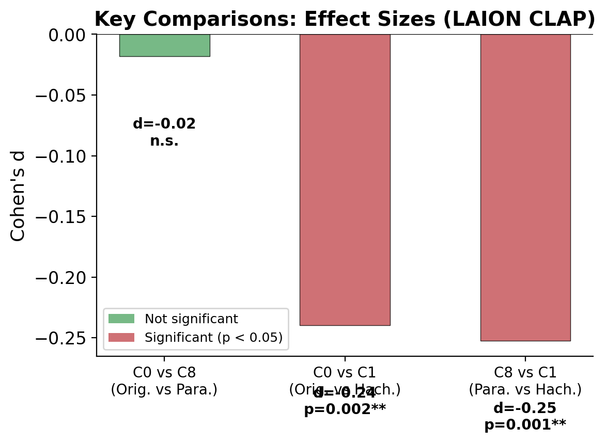
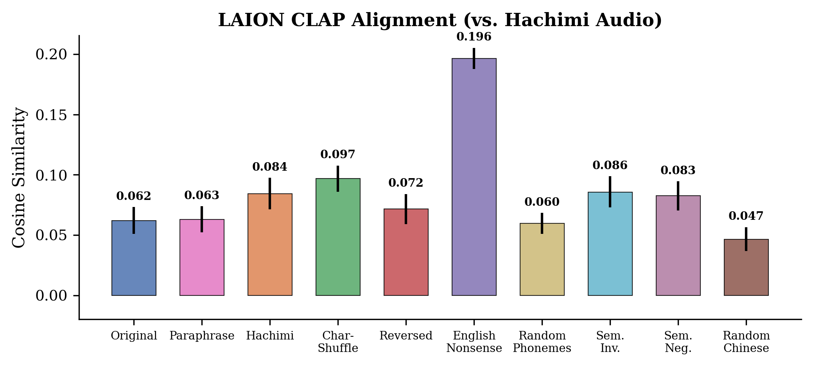
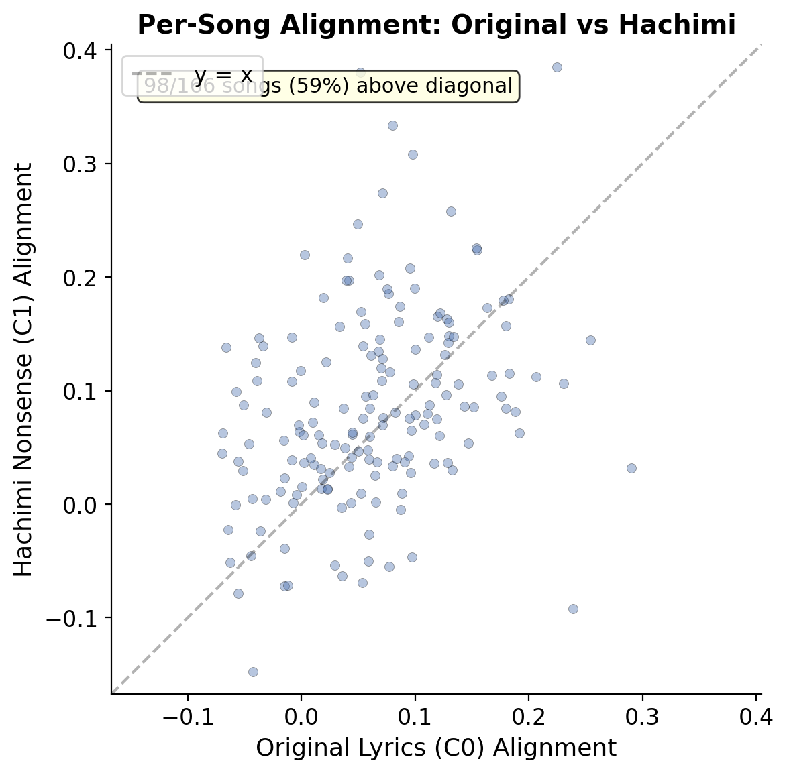
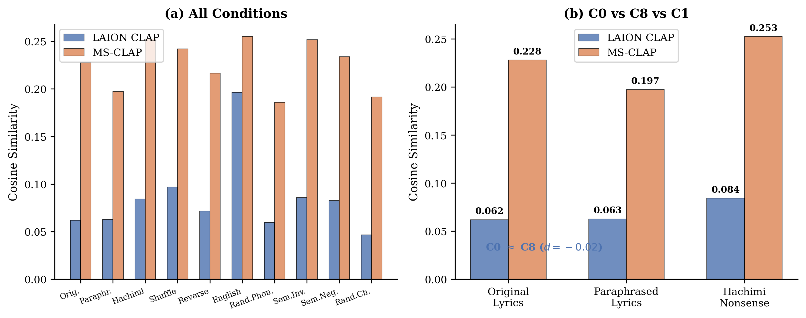
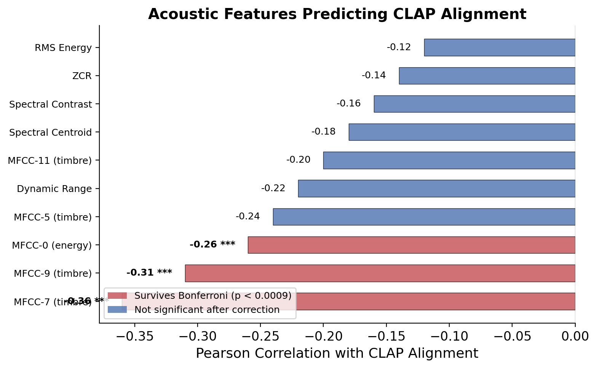
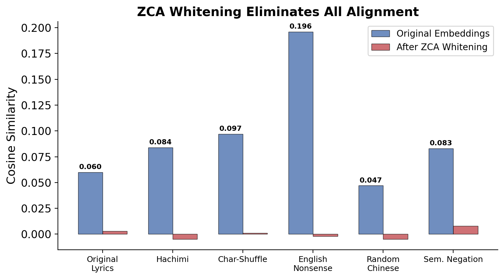
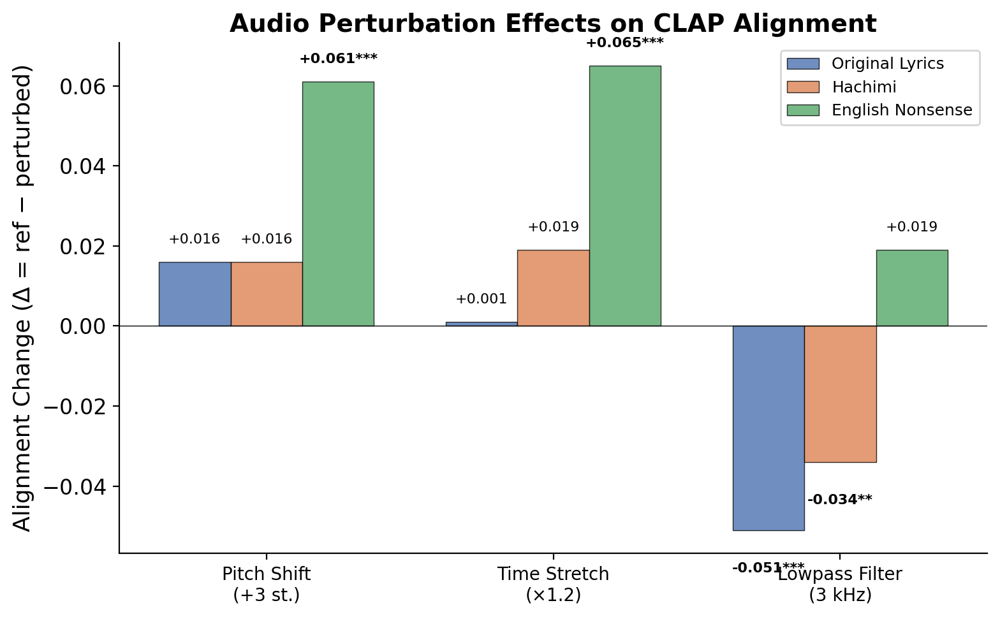
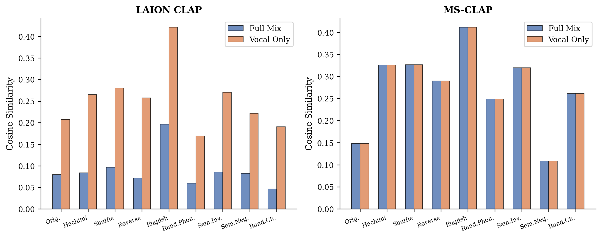

# When Meaning Dissolves: What Audio-Text Alignment Models Actually Encode

[Paper (PDF)](paper/main.pdf) | [Dataset (HuggingFace)](https://huggingface.co/datasets/heihei/hachimi-alignment) | [BibTeX](#citation)

> ACL 2025

## Overview

We investigate whether semantic content in text contributes to audio-text alignment, using Chinese **hachimi lyrics** (哈基米歌词) as a natural probe across **three CLAP variants**.

Hachimi songs replace original meaningful lyrics with nonsense syllables like "ha-ji-mi" while preserving melody, instrumentation, and vocal timbre. This creates a natural experiment: if CLAP is truly sensitive to **semantic** content, then original lyrics should align better than nonsense. Instead, we find **model-dependent** sensitivity — preserving semantics or phonology alone is insufficient to predict alignment behavior.

<p align="center">

</p>

<p align="center">

</p>

## Key Findings

**Core result:** CLAP variants show *model-dependent* sensitivity to lyric surface form. Both LAION CLAP variants treat meaning-preserving paraphrases identically to originals, while Microsoft CLAP does distinguish them. All three models agree that nonsense hachimi lyrics achieve higher alignment than original lyrics.

| Condition | Description | LAION CLAP | LAION-Fused | MS-CLAP |
|:---:|:---|:---:|:---:|:---:|
| **C0** | Original lyrics | 0.062 | 0.031 | 0.228 |
| **C8** | Paraphrased lyrics (same meaning) | 0.063 | 0.030 | 0.197 |
| **C1** | Hachimi nonsense syllables | **0.084** | **0.031** | **0.253** |
| C0 vs C8 | Paraphrase effect | d=-0.02, p=0.82 | d=0.14, p=0.08 | d=0.45, p<0.001 |
| C0 vs C1 | Hachimi advantage | d=-0.24, p=0.002 | d=-0.37, p<0.001 | d=-0.27, p<0.001 |

**Pattern:** Paraphrase sensitivity is model-dependent; hachimi advantage is universal across all models.

<p align="center">

</p>

## 1. Alignment Across the Degeneration Spectrum

We construct 10 text conditions (C0--C8) systematically varying semantic and structural integrity:

| Condition | Operation | What It Tests |
|:---:|:---|:---|
| C0 | Original meaningful lyrics | Semantic baseline |
| **C8** | **LLM rewording, same meaning** | **Semantic control** |
| C1 | Nonsense hachimi lyrics | Non-semantic baseline |
| C2 | Characters scrambled within words | Orthographic cues |
| C3 | Word segments reversed | Sequential structure |
| C4 | English syllable walk | Cross-lingual phonotactics |
| C5 | Random Chinese syllables | Phonetic texture |
| C6 | Negations in hachimi | Sem. ops on non-semantic |
| C6b | Negations in original lyrics | Sem. ops on meaningful |
| C7 | Random common characters | Structure-free control |

**Critical comparison:** C0 and C8 share identical meaning (different words), while C1 shares surface form (Chinese text) but no meaning.

<p align="center">

</p>

All 10 text conditions tested against hachimi audio (N=166 songs). Error bars: 95% bootstrap CIs. English nonsense achieves the highest alignment due to LAION CLAP's English-dominant training data bias.

### Per-Song Analysis

<p align="center">

</p>

Each dot is one song. 59% of songs show hachimi nonsense (C1) achieving higher alignment than original lyrics (C0). The per-song C0--C1 gap correlates strongly between full-song and matched-segment analyses ($r{=}0.80$).

### Case Studies

| Song | Original (C0) | Paraphrase (C8) | Hachimi (C1) |
|:---|:---:|:---:|:---:|
| Pleasant Goat (喜羊羊) | -0.057 | -0.060 | **0.099** |
| Wind Trio (哈基三郎) | -0.069 | -0.081 | **0.063** |

Original: *"Don't judge me as just a sheep, the grass is sweeter because of me"* ≈ Paraphrase: *"Don't look at me as just a sheep, because of me the grass is more fragrant"* → nearly identical alignment. Hachimi: *"hi hi hi ji-mi my plums are many"* → substantially higher.

## 2. Cross-Model Comparison

<p align="center">

</p>

**All three CLAP variants agree** on the core finding: hachimi nonsense (C1) > original lyrics (C0).

- **LAION CLAP** (512-dim, English-dominant): Cannot distinguish originals from paraphrases ($d{=}{-}0.02$, $p{=}0.82$)
- **LAION-Fused** (with cross-modal fusion): Also cannot distinguish ($d{=}0.14$, $p{=}0.08$), shows largest hachimi advantage ($d{=}{-}0.37$)
- **Microsoft CLAP** (1024-dim, multilingual): Shows moderate C0 > C8 separation ($d{=}0.45$), confirmed via **length-matched truncation control** ($d{=}0.38$ after equalizing text length)

The English nonsense dominance is LAION-specific (msCLAP: only marginally higher), suggesting tokenizer-level rather than semantic effects.

## 3. Retrieval Metrics

We evaluate whether condition identity can be retrieved from audio using CLAP embeddings:

| Metric | Value |
|:---|:---:|
| Original lyrics Recall@1 | 1.8% |
| Original lyrics median rank | 6.0 / 9 |
| Hachimi (C1) beats original (C0) | 59% of songs |
| Top-1 condition | English nonsense (C4, 74%) |

Original lyrics rank near the bottom (median rank 6/9), while English nonsense dominates retrieval (122/166 songs). This confirms that CLAP's alignment does not prioritize semantic content.

## 4. Phonology Control: Homophone Experiment

To isolate phonological from semantic effects, we replace each character with a **homophone** (same pronunciation, different meaning):

| Condition | Mean Alignment | vs Original |
|:---|:---:|:---:|
| C0 (original) | 0.062 | — |
| Homophone replacement | 0.051 | d=-0.27, p<0.001 |

Despite preserving all phonological information (75.9% character replacement rate), homophones produce *lower* alignment than originals. This rules out pure phonological matching as the explanation and suggests orthographic familiarity or sub-word token patterns matter.

## 5. Temporal Matching Control

To rule out temporal misalignment as an artifact, we extract temporally matched segments using chroma cross-correlation (107 matched pairs, 64% of songs).

| Analysis | C0 Alignment | C1 Alignment | $d$ | $p$ |
|:---|:---:|:---:|:---:|:---:|
| Full song (LAION) | 0.062 | 0.084 | -0.24 | 0.002 |
| Matched segments (LAION) | 0.028 | 0.052 | 0.27 | 0.006 |
| Matched segments (msCLAP) | — | — | -0.24 | 0.014 |

The per-song C0--C1 gap correlates strongly between full-song and matched-segment analyses ($r{=}0.80$), with 81% of songs agreeing in gap direction. Segment duration does not predict the gap ($r{=}0.07$), ruling out temporal confounds.

## 6. Acoustic Properties

### What Predicts Alignment?

<p align="center">

</p>

We extract 57-dimensional acoustic feature vectors (MFCC, spectral, chroma, rhythm, energy) and correlate with per-song CLAP alignment. Three MFCC coefficients survive Bonferroni correction:

| Feature | $r$ | $p_{\text{bonf}}$ |
|:---|:---:|:---:|
| MFCC-7 (timbre) | -0.36 | 0.0001 |
| MFCC-9 (timbre) | -0.31 | 0.002 |
| MFCC-0 (energy envelope) | -0.26 | 0.04 |

Hachimi and original recordings share near-identical acoustic profiles (cosine = 0.999), explaining why text variation has minimal effect.

### ZCA Whitening

<p align="center">

</p>

ZCA whitening removes modality-specific covariance structure and **eliminates all alignment** for every condition (max = 0.008 vs. original max = 0.196, all $p < 10^{-13}$). This shows CLAP's alignment depends on cross-modal correlation structure rather than isotropic features.

### Audio Perturbation

<p align="center">

</p>

Three perturbation types tested on 80 songs:

- **Pitch shift / Time stretch**: No significant effect on Chinese text, but significant for English nonsense ($d{\approx}0.71$). CLAP's English-text pathway is more acoustically sensitive.
- **Lowpass filtering**: *Increases* alignment for Chinese text ($d{=}{-}0.54$ for originals). Lowpass removes high-frequency spectral mismatch.
- Modality dominance analysis shows roughly equal contribution ($|\Delta_{\text{audio}}|/|\Delta_{\text{text}}|{=}1.06$).

### Vocal-Only vs. Full-Mix

<p align="center">

</p>

Removing instruments **amplifies** the original < hachimi separation:
- LAION CLAP: full-mix $d{=}{-}0.24$ → vocal-only $d{=}{-}0.47$
- MS-CLAP: vocal-only $d{=}{-}1.32$

Instrumental accompaniment attenuates but does not reverse the pattern.

## 7. Embedding Structure

Despite identical alignment behavior, original and hachimi lyrics have very different CLAP text embeddings (CKA = 0.10). Probing classifiers decode conditions well above chance:

| Model | Accuracy | C0 vs C1 Distinction |
|:---|:---:|:---|
| BERT | 90.3% | 0.94 |
| CLAP | 71.2% | 0.57 |

CLAP achieves the lowest accuracy and poorly distinguishes original from hachimi. This dissociation suggests CLAP's text encoder captures surface features that do **not** propagate to the joint embedding space.

## Discussion

**Why does this matter?** These findings have practical implications for music information retrieval:

- LLM-generated text descriptions may align poorly with audio even when semantically correct
- Queries differing in phonological structure from target audio will systematically underperform
- Text-audio retrieval may capture text-music **genre associations** rather than semantic understanding
- Paraphrase sensitivity varies across model architectures — not all CLAP variants behave identically

**Interpretation:** CLAP variants show nontrivial sensitivity to lyric surface form under Chinese perturbations; this sensitivity is not reducible to meaning-preserving paraphrase effects or pure phonology preservation. Scaling up text encoders or using stronger pretraining may change the balance.

## Dataset

166 paired hachimi-original Chinese songs, including temporally matched audio segments.

| Content | Count | Format |
|:---|:---:|:---|
| Song pairs (original + hachimi) | 166 | MP3 |
| Matched audio segments | 236 | WAV, 22,050 Hz |
| Text conditions (C0--C8) | 166 × 10 | JSON |
| LLM paraphrases (C8) | 165 | JSON |
| Homophone replacements | 166 | JSON |

Audio data: [huggingface.co/datasets/heihei/hachimi-alignment](https://huggingface.co/datasets/heihei/hachimi-alignment)

## Reproduction

```bash
# Clone
git clone https://github.com/ngyygm/hachimi-alignment.git
cd hachimi-alignment

# Install
pip install -r requirements.txt

# Download audio from HuggingFace
pip install huggingface_hub
huggingface-cli download heihei/hachimi-alignment --local-dir data
```

```bash
# Step 1: Generate paraphrases (requires MINIMAX_API_KEY)
export MINIMAX_API_KEY="your-key"
python scripts/1_generate_paraphrases.py

# Step 2: Compute CLAP/msCLAP alignment
python scripts/2_compute_alignment.py

# Step 3: Match temporal segments
python scripts/3_match_segments.py

# Step 4: Export matched audio
python scripts/4_export_segments.py

# Step 5: Alignment on matched segments
python scripts/5_matched_alignment.py

# Step 6: Comparison experiments
python scripts/6_segment_analysis.py

# Step 7: Generate figures
python scripts/7_generate_figures.py
```

```bash
# Compile paper
cd paper && latexmk -xelatex main.tex
```

## Citation

```bibtex
@inproceedings{author2025hachimi,
  title={When Meaning Dissolves: What Audio-Text Alignment Models Actually Encode},
  author={Anonymous},
  booktitle={Proceedings of the Association for Computational Linguistics (ACL)},
  year={2025}
}
```

## License

MIT
